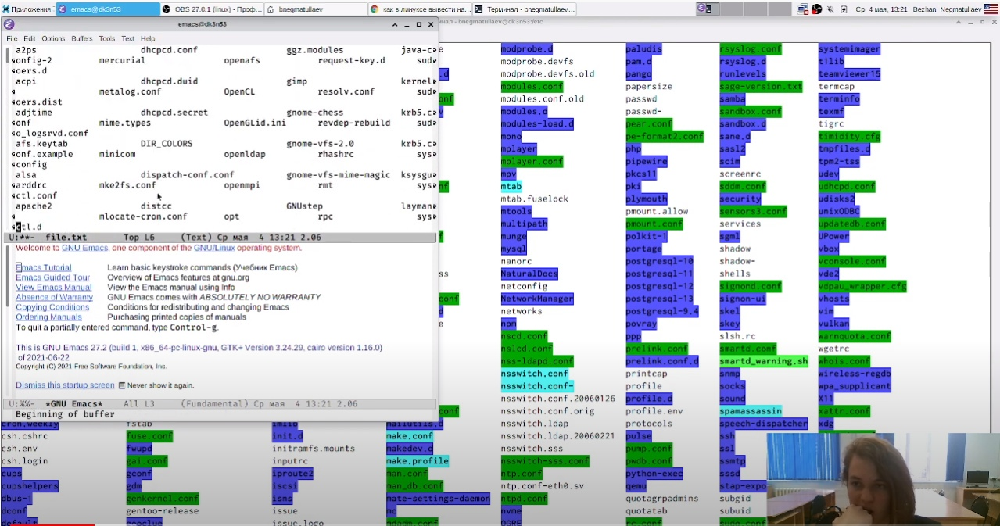
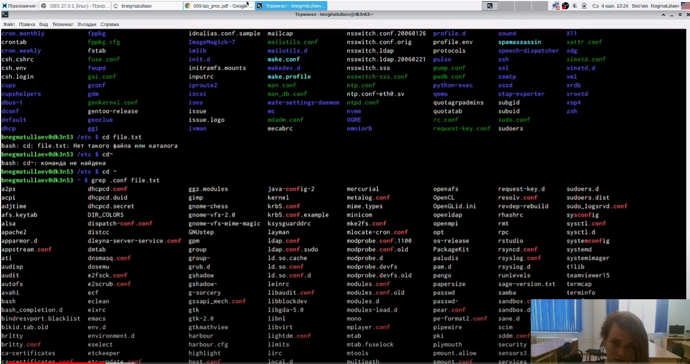
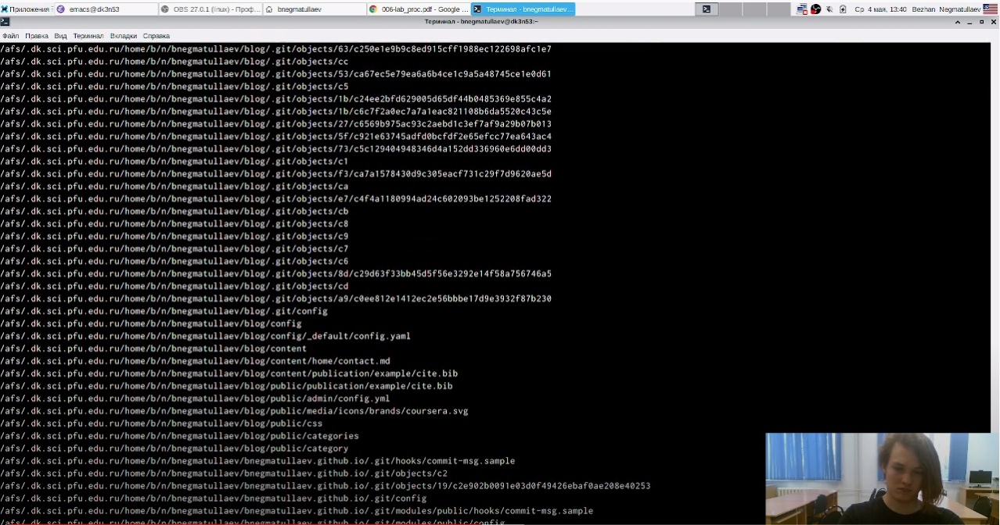
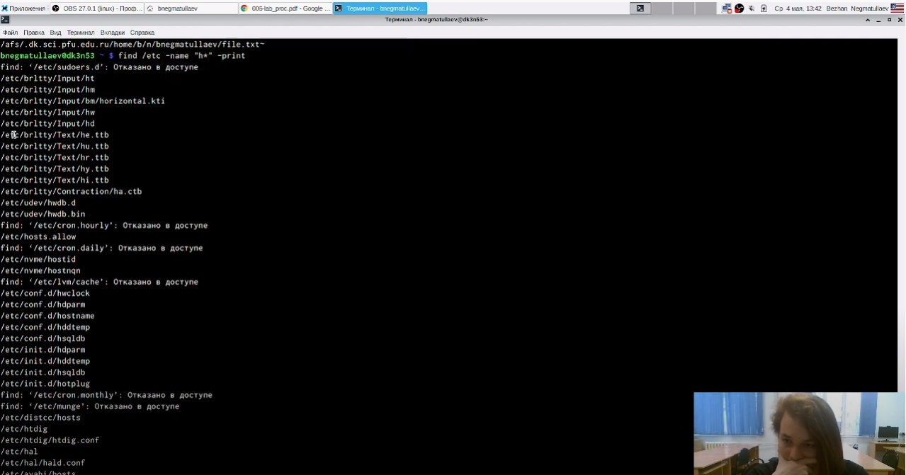
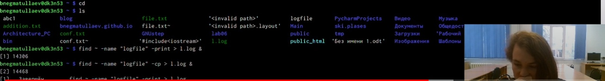
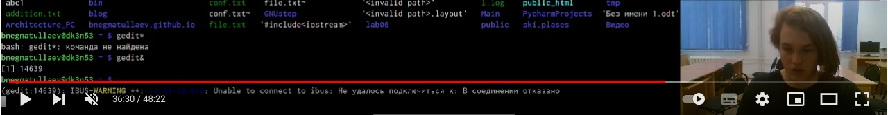
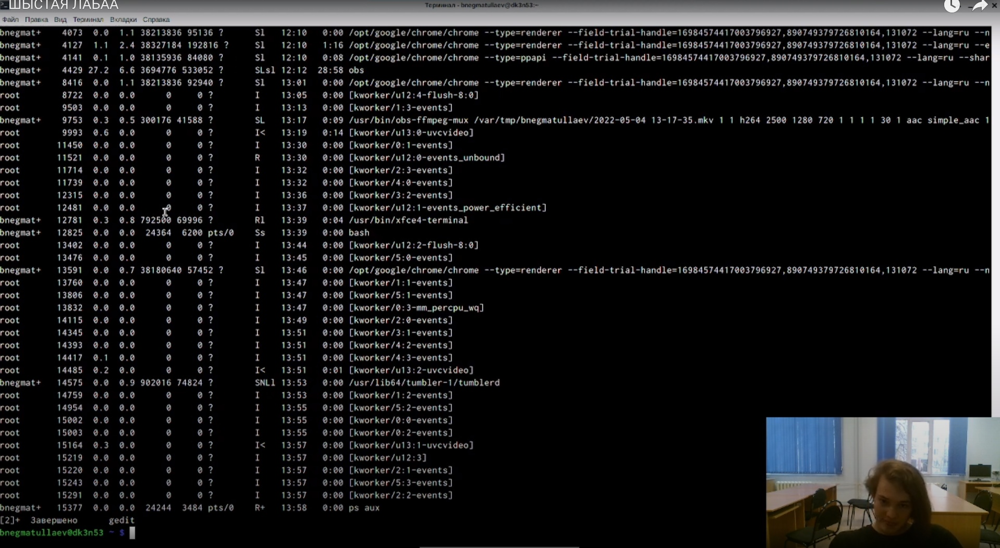
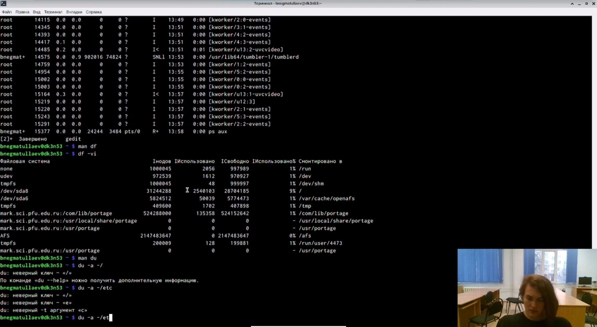
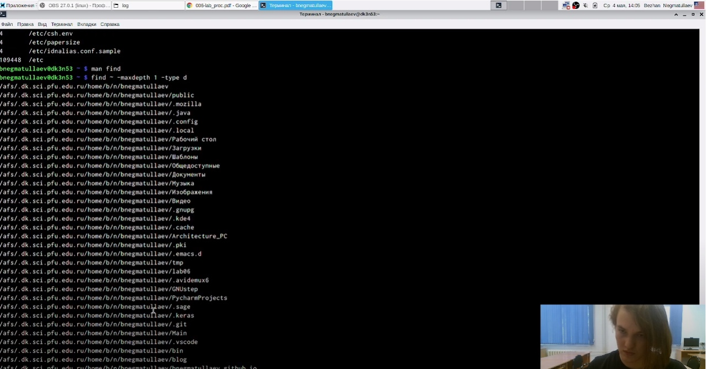

---
## Front matter
lang: ru-RU
title: Лабораторная работа №6
author: |
    Негматуллаев Бежан - студент группы НФИбд-02-21
date: 06.05.2022

## Formatting
toc: false
slide_level: 2
theme: metropolis
header-includes: 
 - \metroset{progressbar=frametitle,sectionpage=progressbar,numbering=fraction}
 - '\makeatletter'
 - '\beamer@ignorenonframefalse'
 - '\makeatother'
aspectratio: 43
section-titles: true
---

# Поиск файлов. Перенаправление ввода-вывода. Просмотр запущенных процессов

## Цель работы

Ознакомление с инструментами поиска файлов и фильтрации текстовых данных.
Приобретение практических навыков: по управлению процессами (и заданиями), по
проверке использования диска и обслуживанию файловых систем.

## Выполнение лабораторной работы

1. Запишите в файл file.txt названия файлов, содержащихся в каталоге /etc. Допишите в этот же файл названия файлов, содержащихся в вашем домашнем каталоге 

## 

2. Выведите имена всех файлов из file.txt, имеющих расширение .conf, после чего
запишите их в новый текстовой файл conf.txt.

## 

3. Определите, какие файлы в вашем домашнем каталоге имеют имена, начинавшиеся с символа c? Предложите несколько вариантов, как это сделать.

## 

4. Выведите на экран (по странично) имена файлов из каталога /etc, начинающиеся с символа h.

## 

5. Запустите в фоновом режиме процесс, который будет записывать в файл ~/logfile файлы, имена которых начинаются с log.

## 

6. Удалите файл ~/logfile. Запустите из консоли в фоновом режиме редактор gedit.

## 

7. Определите идентификатор процесса gedit, используя команду ps, конвейер и фильтр
grep. Как ещё можно определить идентификатор процесса? Прочтите справку (man) команды kill, после чего используйте её для завершения
процесса gedit.

## 

8. Выполните команды df и du, предварительно получив более подробную информацию
об этих командах, с помощью команды man.

## 

9. Воспользовавшись справкой команды find, выведите имена всех директорий, имеющихся в вашем домашнем каталоге.

## Вывод

Ознакомились с инструментами поиска файлов и фильтрации текстовых данных.
Приобрели практические навыки по управлению процессами (и заданиями), по
проверке использования диска и обслуживанию файловых систем.
