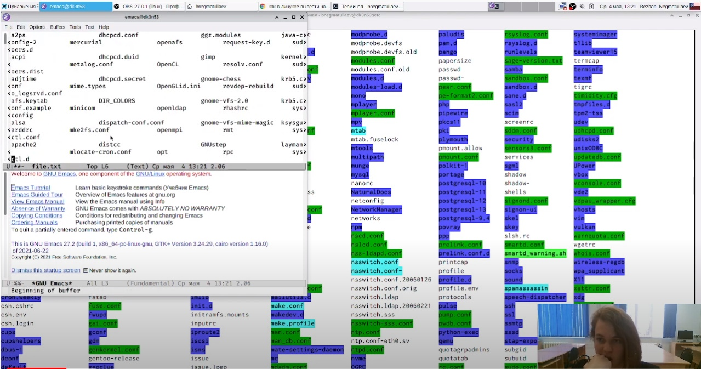
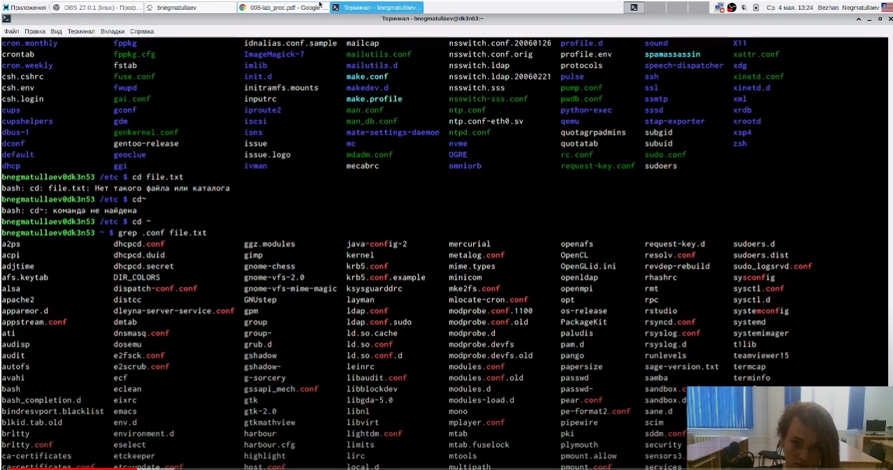
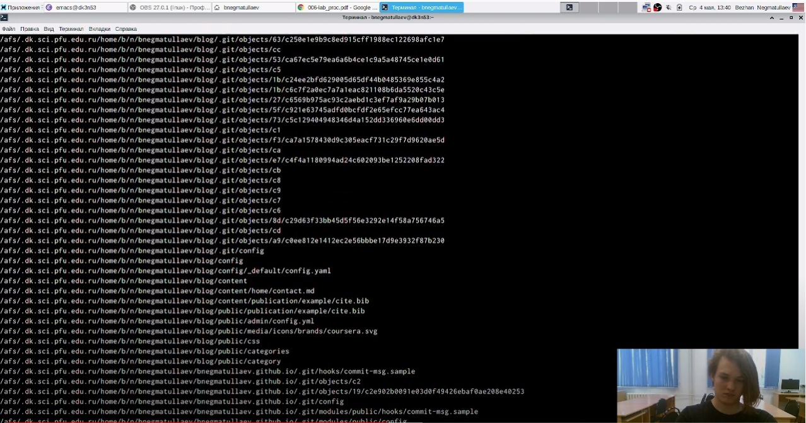
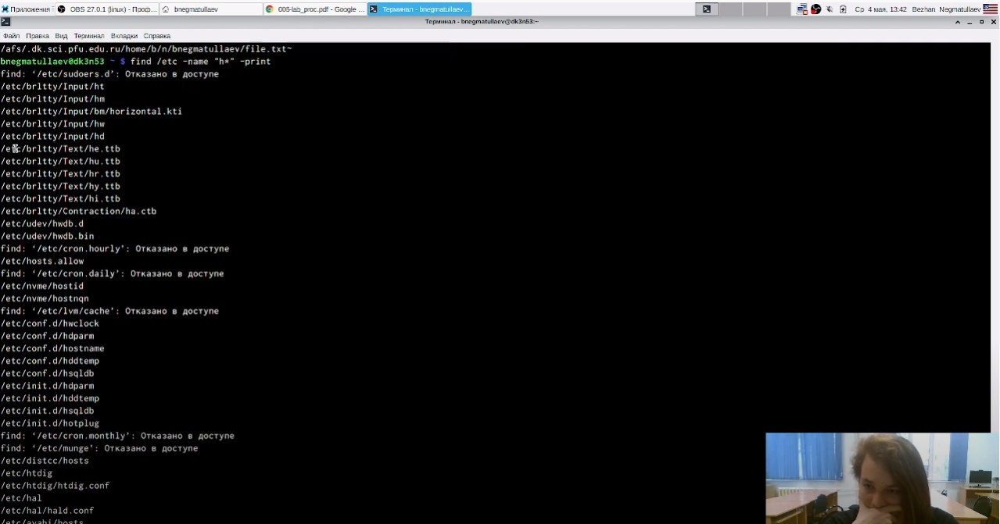
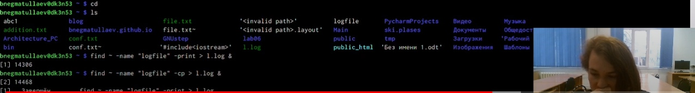
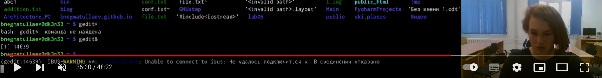
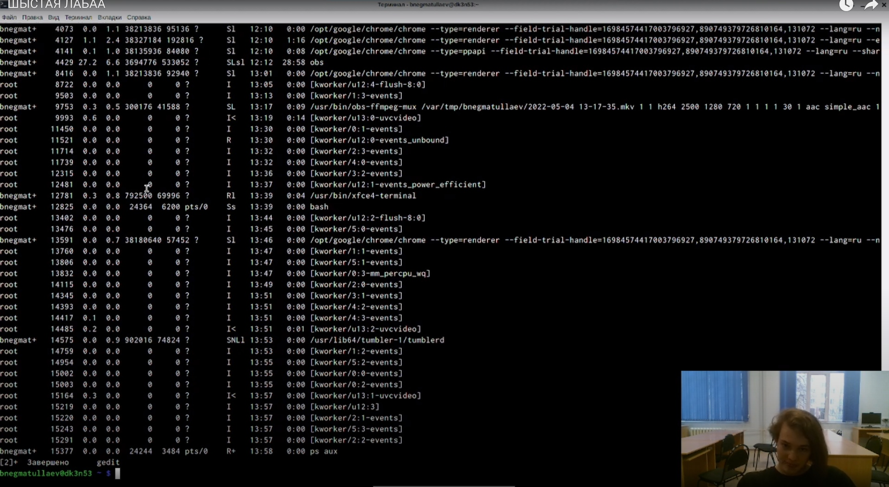
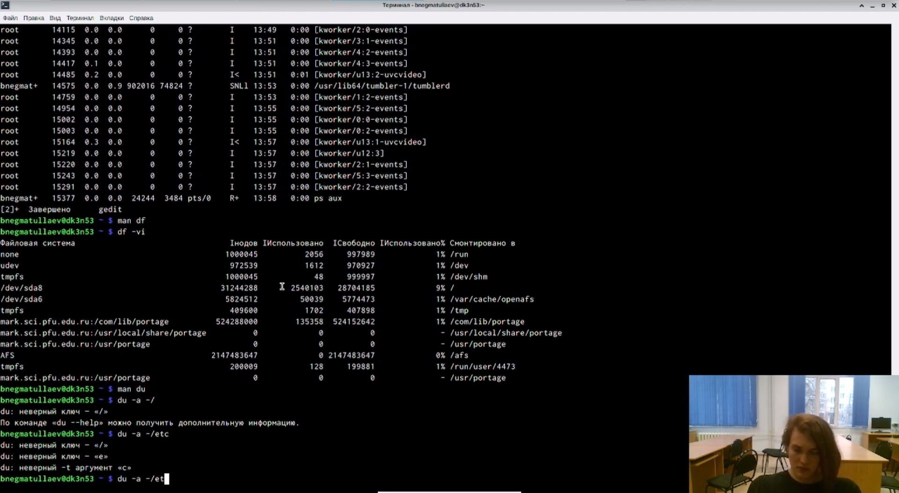
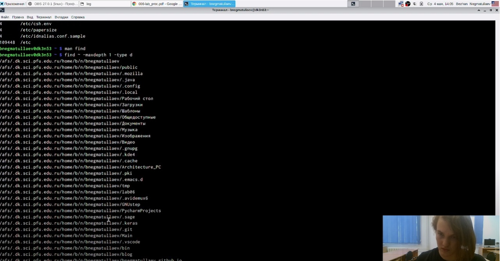

---
# Front matter
lang: ru-RU
title: "Лабораторная работа 6"
subtitle: "Поиск файлов. Перенаправление ввода-вывода. Просмотр запущенных процессов"
author: "Негматуллаев Бежан Шухратович"

# Formatting
toc-title: "Содержание"
toc: true # Table of contents
toc_depth: 2
fontsize: 12pt
linestretch: 1.5
papersize: a4paper
documentclass: scrreprt
polyglossia-lang: russian
polyglossia-otherlangs: english
mainfont: PT Serif
romanfont: PT Serif
sansfont: PT Sans
monofont: PT Mono
mainfontoptions: Ligatures=TeX
romanfontoptions: Ligatures=TeX
sansfontoptions: Ligatures=TeX,Scale=MatchLowercase
monofontoptions: Scale=MatchLowercase
indent: true
pdf-engine: lualatex
header-includes:
  - \linepenalty=10 # the penalty added to the badness of each line within a paragraph (no associated penalty node) Increasing the value makes tex try to have fewer lines in the paragraph.
  - \interlinepenalty=0 # value of the penalty (node) added after each line of a paragraph.
  - \hyphenpenalty=50 # the penalty for line breaking at an automatically inserted hyphen
  - \exhyphenpenalty=50 # the penalty for line breaking at an explicit hyphen
  - \binoppenalty=700 # the penalty for breaking a line at a binary operator
  - \relpenalty=500 # the penalty for breaking a line at a relation
  - \clubpenalty=150 # extra penalty for breaking after first line of a paragraph
  - \widowpenalty=150 # extra penalty for breaking before last line of a paragraph
  - \displaywidowpenalty=50 # extra penalty for breaking before last line before a display math
  - \brokenpenalty=100 # extra penalty for page breaking after a hyphenated line
  - \predisplaypenalty=10000 # penalty for breaking before a display
  - \postdisplaypenalty=0 # penalty for breaking after a display
  - \floatingpenalty = 20000 # penalty for splitting an insertion (can only be split footnote in standard LaTeX)
  - \raggedbottom # or \flushbottom
  - \usepackage{float} # keep figures where there are in the text
  - \floatplacement{figure}{H} # keep figures where there are in the text
---

# Цель работы

Ознакомление с инструментами поиска файлов и фильтрации текстовых данных.
Приобретение практических навыков: по управлению процессами (и заданиями), по
проверке использования диска и обслуживанию файловых систем.

# Выполнение лабораторной работы

1. Запишите в файл file.txt названия файлов, содержащихся в каталоге /etc. Допишите в этот же файл названия файлов, содержащихся в вашем домашнем каталоге (рис. 1)

{ #fig:001 width=90% }

2. Выведите имена всех файлов из file.txt, имеющих расширение .conf, после чего
запишите их в новый текстовой файл conf.txt. (рис. 2)

{ #fig:002 width=90% }

3. Определите, какие файлы в вашем домашнем каталоге имеют имена, начинавшиеся с символа c? Предложите несколько вариантов, как это сделать. (рис. 3)

{ #fig:003 width=90% }

4. Выведите на экран (по странично) имена файлов из каталога /etc, начинающиеся с символа h. (рис. 4) 

{ #fig:004 width=90% }

5. Запустите в фоновом режиме процесс, который будет записывать в файл ~/logfile файлы, имена которых начинаются с log. (рис. 5)

{ #fig:005 width=90% }

6. Удалите файл ~/logfile. Запустите из консоли в фоновом режиме редактор gedit.(рис. 6)

{ #fig:006 width=70% }

7. Определите идентификатор процесса gedit, используя команду ps, конвейер и фильтр
grep. Как ещё можно определить идентификатор процесса? Прочтите справку (man) команды kill, после чего используйте её для завершения
процесса gedit. (рис. 7)

{ #fig:007 width=70% }

8. Выполните команды df и du, предварительно получив более подробную информацию
об этих командах, с помощью команды man. (рис. 8)

{ #fig:008 width=70% }

9. Воспользовавшись справкой команды find, выведите имена всех директорий, имеющихся в вашем домашнем каталоге. (рис. 9)

{ #fig:009 width=70% }

# Вывод

Ознакомились с инструментами поиска файлов и фильтрации текстовых данных.
Приобрели практические навыки по управлению процессами (и заданиями), по
проверке использования диска и обслуживанию файловых систем.

# Контрольные вопросы
*1. Какие потоки ввода вывода вы знаете*

**Ответ:** 1.	– stdin — стандартный поток ввода (клавиатура),

–	stdout — стандартный поток вывода (консоль),

–	stderr — стандартный поток вывод сообщений об ошибках на экран

*2. Объясните разницу между операцией > и >>.*

**Ответ:** Символ < используется для переназначения стандартного ввода команды.
Символ >> используется для присоединения данных в конец файла стандартного вывода команды(файл открывается в режиме добавления)

*3. Что такое конвейер?*

**Ответ:** Конвейер - способ связи между двумя программами.Конвейер (pipe) служит для объединения простых команд или утилит в цепочки, в которых результат работы предыдущей команды передается последующей. Синтаксис следующий: команда1 | команда 2

*4. Что такое PID и GID?*

**Ответ:** Process ID(PID) - идентификатор порожденного процесса. Group ID (GID-идентификация группы пользователей.

*5. Что такое процесс? Чем это понятие отличается от программы??*

**Ответ:**	Процесс - это программа, которая выполняется в отдельном виртуальном адресном пространстве. Когда пользователь регистрируется в системе, автоматически создается процесс, в котором выполняется оболочка (shell), например, /bin/bash.
Компьютерная программа сама по себе — это только пассивная совокупность инструкций, в то время как процесс — это непосредственное выполнение этих инструкций.

*6. Что такое задачи и какая команда позволяет ими управлять?*

**Ответ:** Запущенные фоном программы называются задачами (jobs). Ими можно управлять с помощью команды jobs, которая выводит список запущенных в данный момент задач. Для завершения задачи необходимо выполнить команду :
kill %номер задачи

*7. Найдите информацию об утилитах top и htop. Каковы их функции?*
**Ответ:** top показывает объем занятой памяти вместе с кэш. htop выдает объём реально занятой памяти без кэша.

*10. Как определить объем свободной памяти на жёстком диске?*
**Ответ:** Кодмандой df

*11. Как определить объем вашего домашнего каталога?*
**Ответ:** Кодмандой du

*12. Как удалить зависший процесс?*
**Ответ:** kill PID
