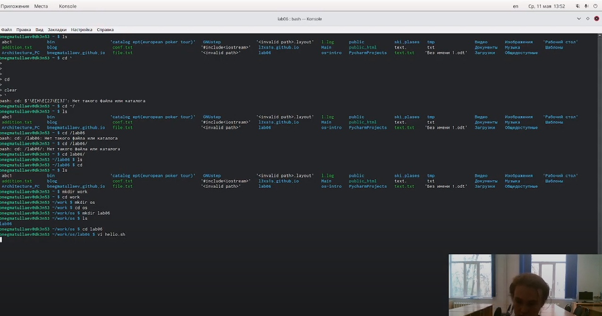
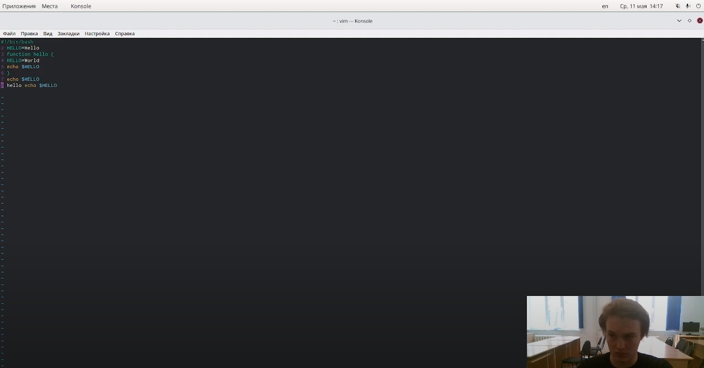
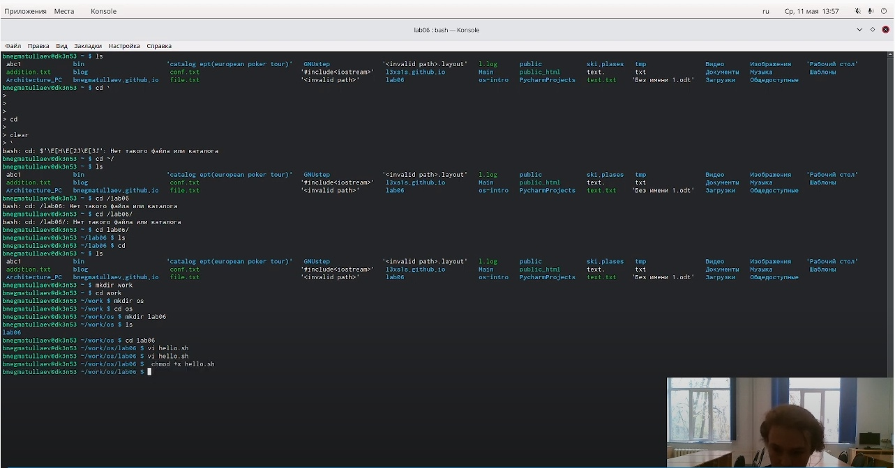

---
## Front matter
lang: ru-RU
title: Лабораторная работа №8
author: |
    Негматуллаев Бежан - студент группы НФИбд-02-21
date: 11.05.2022

## Formatting
toc: false
slide_level: 2
theme: metropolis
header-includes: 
 - \metroset{progressbar=frametitle,sectionpage=progressbar,numbering=fraction}
 - '\makeatletter'
 - '\beamer@ignorenonframefalse'
 - '\makeatother'
aspectratio: 43
section-titles: true
---

# Цель работы

Познакомиться с операционной системой Linux. Получить практические навыки работы с редактором vi, установленным по умолчанию практически во всех дистрибутивах.

# Выполнение лабораторной работы

1. Создадим файл hello.sh (рис. 1)

{ #fig:001 width=90% }

2. Запишем в него то что требуется в лабораторной работе (рис. 2)

{ #fig:002 width=90% }

3. Сделаем файл исполняемым(рис. 3)

{ #fig:003 width=90% }

4. Далее необходимо было проделать работу по изменению файла с помощью горячих клавиш. С результатами можно ознакомиться в видеоотчете (Выполнение)

# Вывод

Познакомились с операционной системой Linux. Получили практические навыки работы с редактором vi, установленным по умолчанию практически во всех дистрибутивах.
