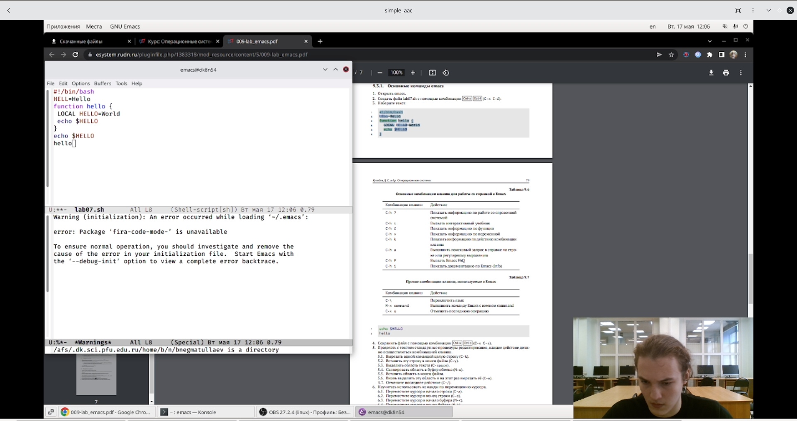

---
## Front matter
lang: ru-RU
title: Лабораторная работа №9
author: |
    Негматуллаев Бежан - студент группы НФИбд-02-21
date: 17.05.2022

## Formatting
toc: false
slide_level: 2
theme: metropolis
header-includes: 
 - \metroset{progressbar=frametitle,sectionpage=progressbar,numbering=fraction}
 - '\makeatletter'
 - '\beamer@ignorenonframefalse'
 - '\makeatother'
aspectratio: 43
section-titles: true
---

# Текстовой редактор emacs

## Цель работы

Познакомиться с операционной системой Linux. Получить практические навыки работы с редактором Emacs.

## Выполнение лабораторной работы

1. Знакомство с emacs и работа с файлом (рис. 1)

{ #fig:001 width=90% }

##

2. Работа с буфером (рис. 2)

{ #fig:002 width=90% }

##

3. Создание 4х окон редактирования (рис. 3)

{ #fig:003 width=90% }

## Вывод

Получили практические навыки работы с редактором Emacs.
