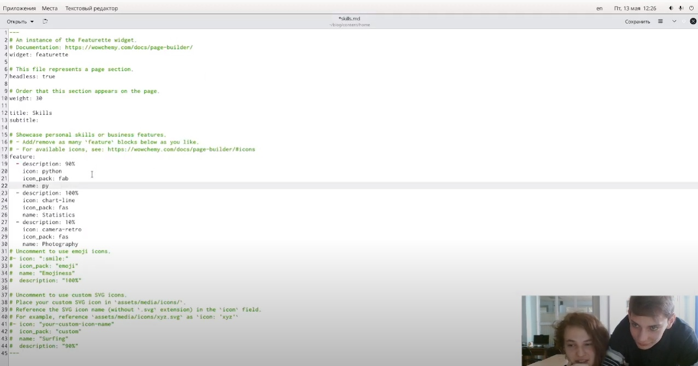
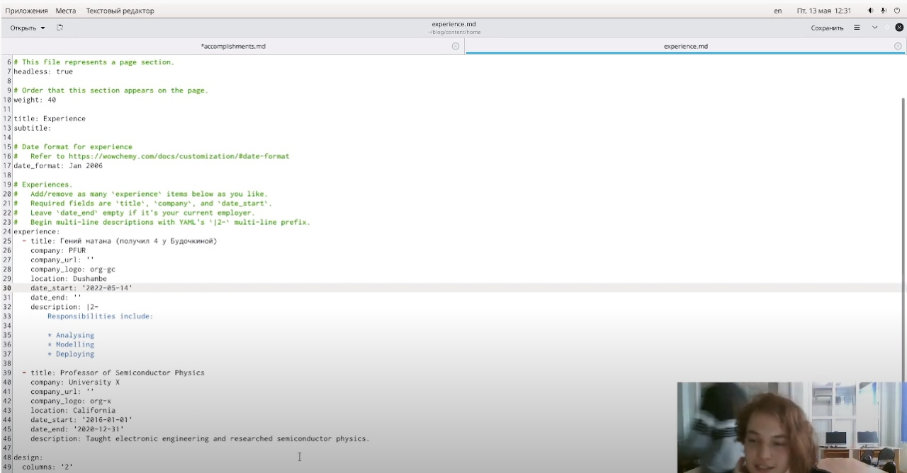
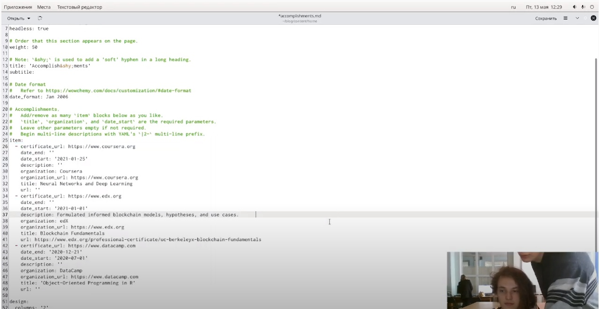
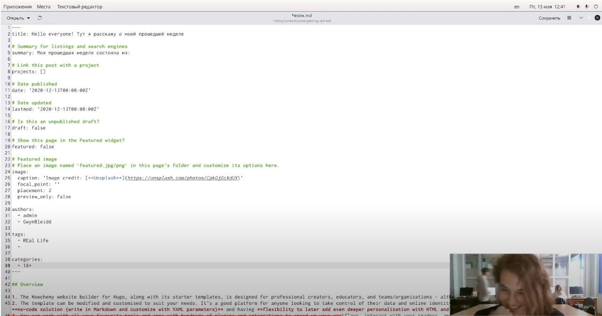
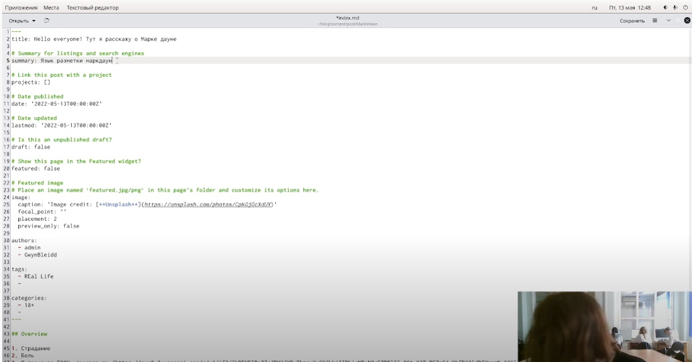

---
## Front matter
lang: ru-RU
title: Лабораторная работа №6
author: |
    Негматуллаев Бежан - студент группы НФИбд-02-21
date: 13.05.2022

## Formatting
toc: false
slide_level: 2
theme: metropolis
header-includes: 
 - \metroset{progressbar=frametitle,sectionpage=progressbar,numbering=fraction}
 - '\makeatletter'
 - '\beamer@ignorenonframefalse'
 - '\makeatother'
aspectratio: 43
section-titles: true
---

# Цель работы

Добавить к сайту еще больше данные о себе. Добавить пост на тему: "MarkDown."

# Выполнение лабораторной работы

1. Добавить информацию о навыках (Skills).

Необходимо зайти в файл `content/home/skills.md` и изменить там данные (рис. 1).

{ #fig:001 width=90% }

2. Добавить информацию об опыте (Experience).

Необходимо зайти в файл `content/home/experience.md` и изменить там данные (рис. 2).

{ #fig:002 width=90% }

3. Добавить информацию о достижениях (Accomplishments).

Необходимо зайти в файл `content/home/accomplishments.md` и изменить там данные (рис. 3).

{ #fig:003 width=90% }

4. Сделать пост по прошедшей неделе. (рис. 4)

{ #fig:004 width=90% }

5. Добавить пост на тему: MarkDown (рис. 5)

{ #fig:005 width=90% }

# Вывод

Добавили данные об опыте, достижениях и навыках. Сделали пост по прошедшей неделе. Сделали пост на тему MarkDown.

