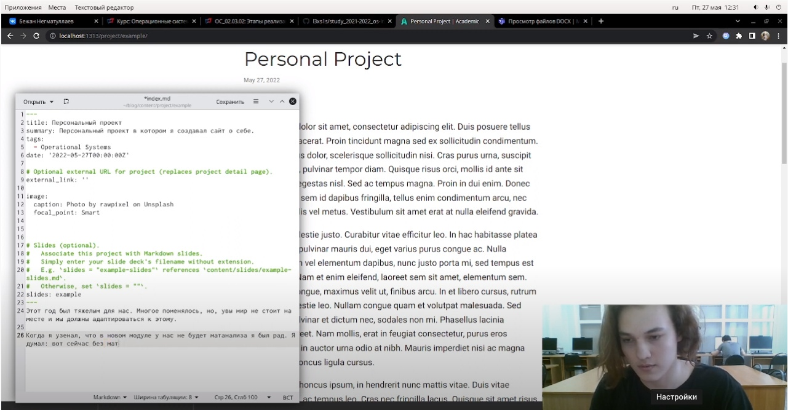
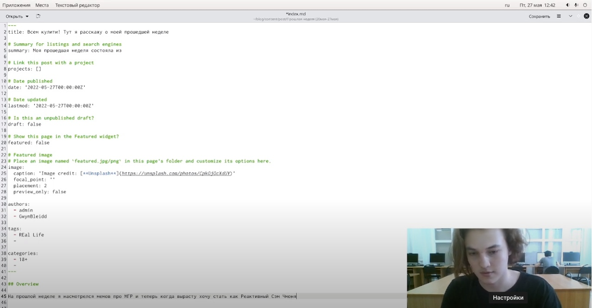
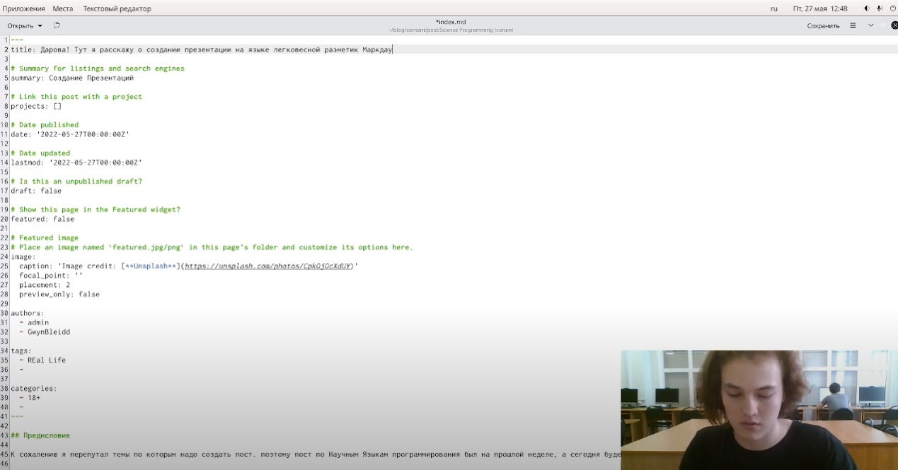

---
## Front matter
lang: ru-RU
title: Индивидуальный проект. Этап 6
author: |
    Негматуллаев Бежан - студент группы НФИбд-02-21
date: 03.06.2022

## Formatting
toc: false
slide_level: 2
theme: metropolis
header-includes: 
 - \metroset{progressbar=frametitle,sectionpage=progressbar,numbering=fraction}
 - '\makeatletter'
 - '\beamer@ignorenonframefalse'
 - '\makeatother'
aspectratio: 43
section-titles: true
---

# Добавление ссылок на литературные источники. Создание постов.

## Цель работы

Добавить поддержку русского языка

## Выполнение лабораторной работы

1. В languages.pyle добавляем возможность использования сайта в двух языках (рис. 1)

{ #fig:001 width=90% }

##

2. Написать пост по прошедшей неделе (рис. 2).

{ #fig:002 width=90% }

##

3. Добавить пост на тему: Создание презентации, так как пост про языки научного программирования был случайно создан на прошлой неделе  (рис. 5)

{ #fig:005 width=90% }

## Вывод

Добавили запись о персональном проекте. Сделали 2 поста: пост по прошедшей неделе и пост на тему "Создание презентации"
